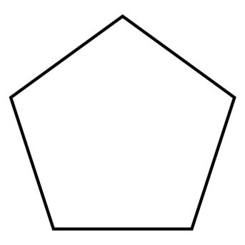
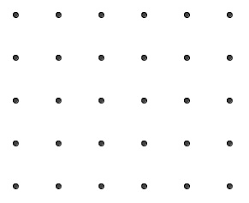
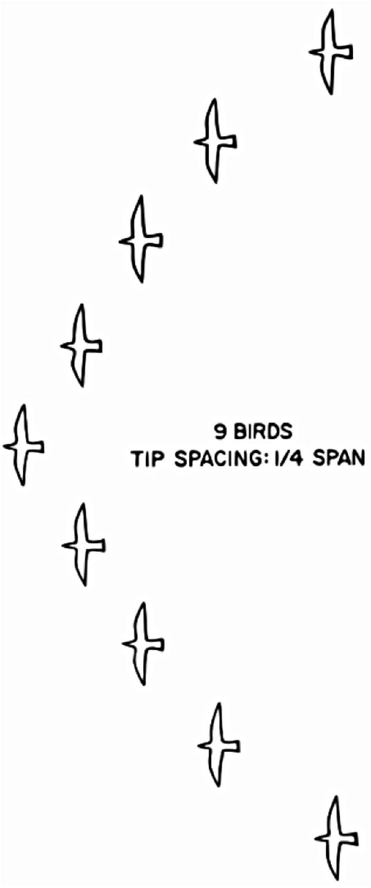

## Setting up the ROS project

After cloning the repository, its submodules have to be initialized and cloned
recursively:

```bash
git submodule update --init --recursive
```

The ROS project can be compiled afterwards:

```bash
source /opt/ros/melodic/setup.bash
cd catkin_ws
catkin_make
```


## Instructions for run the simulation and offboard node

Open 3 different terminals, and run the following commands, one on each of them.

Remember to source the ROS project setup file beforehand with the following
instruction:


```bash
cd <ros-project-path>/devel
source ./setup.bash
```

1. Launch gazebo

	```bash
	cd src/Firmware
	make posix_sitl_default gazebo
	```

2. Launch MavROS

	```bash
	roslaunch mavros px4.launch fcu_url:="udp://:14540@192.168.1.36:14557"
	```
3. Launch the offboardnode

	```bash
	roslaunch offboardnode offboardnode.py
	```


## Initializing Pattern (Package: Formation Control)

The *formation_control* package creates the coordinates, calculates the distances, and creates the links between drones in a desired shape. The formations currently supported are polygon, grids, and v-shape.

    

For the grid and v-shape formations the number of drones to be used is theoretically limitless, however this has not been tested. For the polygon shape, it cannot be used for more than 9 drones, since at 9+ drones the connections create a non-planar graph. This code requires a minimum of 3 drones at all times.

### Function
The code creates a class, which takes in the parameters specified. It then creates coordinates for the shape's points, and from this determines the connections between drones necessary to maintain a steady formation. The resulting connections make a planar graph. The procedure for this differs for each formation type chosen:

#### polygon
The coordinates for this shape take the distance as the radius of the polygon, the amount of drones as the amount of vertices in the polygon (eg 5 drones creates a pentagon)
The polygon connections are created by selecting an initial node, finding the two nearest neighbours, create a triangular connection between these nodes, and then assigning the initial node to be complete. This node can then no longer be selected. It then chooses a neighbour of a neighbour that was just connected, and repeats the procedure. Once this has been completed, it will connect non-complete nodes to each other until the minimum number of connections has been reached. The minimum number of connections needed for a stable formation is defined as *2N - 3*. After 9 drones the code attempts to select a non-complete node and create a triangle with nearest non-complete nodes, which can intersect existing edges. A solution for this may be devised in the future. (ADD IMAGE SHOWING STEPS)

#### grid
The grid pattern connection method follows a simple structure for a complete square (eg 3x3 or 4x4). The algorithm iterates through the row elements, connecting the node with the next neighbour in the row, the neighbour in the row directly below, and its next neighbour in a row (ADD IMAGE). Once the iterator reaches the end of the row, it establishes only a connection with the neighbour in the row directly below. This process is then repeated for the next rows until the final row is selected, in which case the connections formed are once more with the next neighbour untill the final element, which needs no extra connections.

When the amount of drones exceeds a complete square (eg 10 drones), the drones are added first at the end of the rows as an extra column, and if that is full then an extra row is created. The connections created for these are done in a similar fashion as described before.

#### v-shape
The generation of the coordinates for this formation takes requires distance, number of drones and the angle desired for the v-shape.

The v-shape formation is the easiest to connect, since there are only two ways to connect them. If we consider the following shape: \bigwedge, then any node added to the left direction, will form a triangular connection to the two nodes in the layer above. An addition to the right edge connects to the left node in the same layer and the node above its own edge. This constantly forms a planar graph.


The code creates a ROS node, which sets up a service server. A call to this server contains the information needed to create the class, and returns the information needed for a distance-based formation control by filling a matrix where the row index represents the drone id, and the content of the row defines the connections by containing the distance between the drones (eg in a 9 drone grid shape, row 1 column 2 contains the distance between drone id 1 and drone id 2). Non-existing connections are represented by filling the element with a -1 value. 

### Usage
In order to call the service, assign the *formation_control* package to the dependencies in your desired package. Include the header:
```cpp
#include "formation_control/Formation.h"
```

Create a service client to the relevant topic: 

```cpp
ros::NodeHandle n;
ros::ServiceClient client = n.serviceClient<formation_control::Formation>("formation_control");
```

Next assign the values you wish to use:
```cpp
	formation_control::Formation srv;
	srv.request.amount_of_drones = 9;
	srv.request.shape_type = shape;
	srv.request.distance = distance;
	srv.request.angle = v_shape_angle;
```
The recommended storage for the result is a 2D float array:

```cpp
	float result[amount_of_drones][amount_of_drones];
```
Call the service, and if successful copy the data into the array specified above (or edit to store the data in your own container)    
```cpp
if (client.call(srv))
{
	std::cout << "Matrix Size: " << srv.response.matrix_size << std::endl;
	int iterator = 0;
	for (int i = 0; i < srv.response.matrix_size; ++i)
		for (int j = 0; j < srv.response.matrix_size; ++j)
		{
			result[i][j] = srv.response.data[iterator];
			iterator++;
		}
}
```
